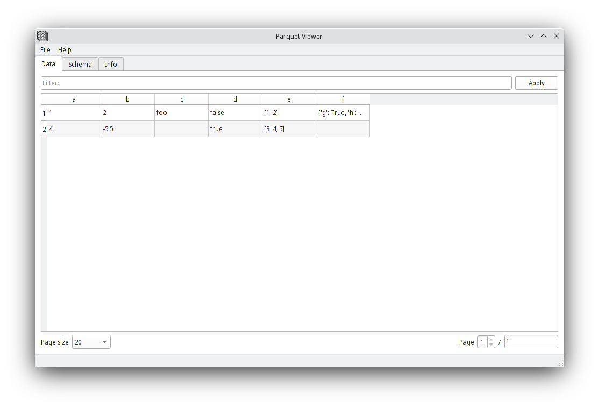
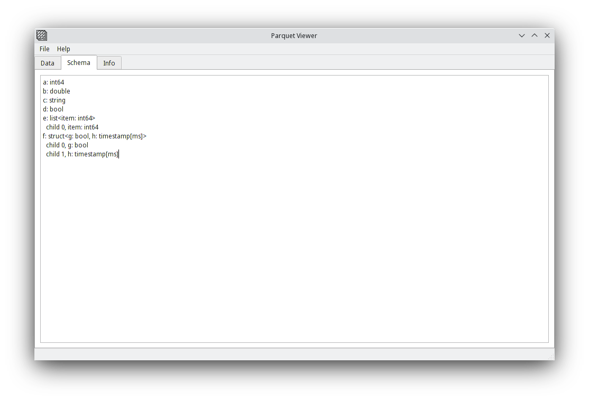
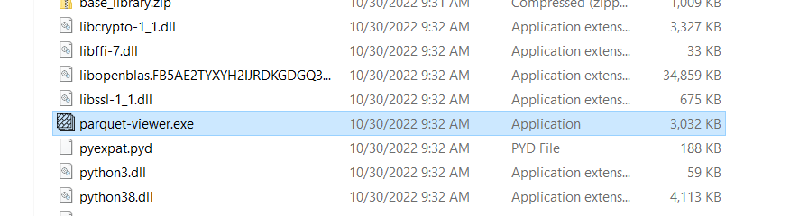

# Parquet Viewer
GUI application based on PyArrow + QT framework to view *.parquet files
Requires python version 3.8+

## Screenshots
Data tab


Schema tab


## Installation
### Windows
Download and extract zip archive for Windows x64 from [Releases page](https://github.com/i026e/py-parquet-viewer/releases)

Launch `parquet-viewer.exe` file


### As python package
_[Optionally] create virtual environment_

Copy link to .whl file from [Releases page](https://github.com/i026e/py-parquet-viewer/releases), 
and run `pip install` providing that link.

For example
```
# python3 -m venv .venv
# source .venv/bin/activate

pip3 install https://github.com/i026e/py-parquet-viewer/releases/download/v0.1.0/parquet_viewer-0.1.0-py3-none-any.whl
```

## Usage
### Filters

Viewer supports filters in SQL-like syntax:

| |                                                                            |
|---|----------------------------------------------------------------------------|
| `column is null`, `column is not null` | applicable for columns of any type, supported for structs and lists        |
| `column ~ '%substring%'` | select rows containing specified substring -- only for string type columns |
| `column = true`, `column = false` | for boolean type columns                                                   |
| `column == 123.123`, `column > 123`, `column >= 123`, `column < 123`, `column <= 123` | for string and number columns                                              |

## Development

Clone repo from GitHub
```shell
git clone git@github.com:i026e/py-parquet-viewer.git
```

Create virtual environment and install dependencies with [poetry](https://python-poetry.org/docs/managing-environments):

```shell
python3 -m venv .venv
source .venv/bin/activate
pip3 install poetry
poetry install
```

To run the application

```shell
poetry run parquet-viewer [path/to/parquet/file]
# OR
./parquet-viewer [path/to/parquet/file]
```

### QTDesigner
To change the UI layout you need [QTDesigner](https://doc.qt.io/qt-5/qtdesigner-manual.html)

Run `qt_designer/run_qt_designer.sh` script to launch it with required plugins loaded

### Build WHL

```shell
poetry build
```

### Build EXE

```shell
poetry run build-exe
```

## Attribution
* [PyQT Framework](https://doc.qt.io/qtforpython/)

* [PyArrow Library](https://arrow.apache.org/docs/python/index.html)

* [Floor icons created by Freepik - Flaticon](https://www.flaticon.com/free-icons/floor)